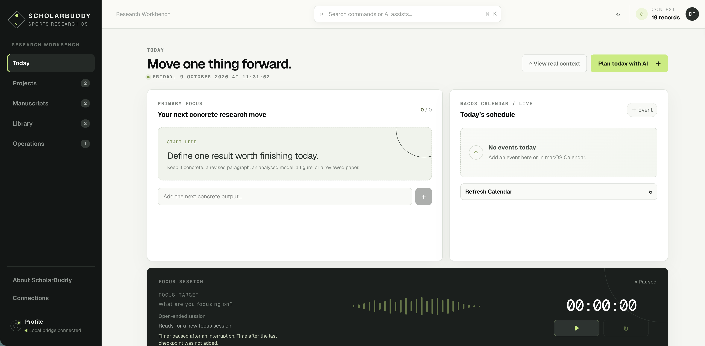

# ScholarBuddy — Sports Research OS

ScholarBuddy is a local-first research workbench for sports analytics and other evidence-heavy research. The hosted interface organizes projects, manuscripts, reading, reviews, submissions, the daily research log, captured ideas, and daily focus. A loopback-only Bridge keeps Obsidian, Zotero, macOS Calendar, and macOS Mail on the researcher's own computer.



## Architecture

```text
Hosted ScholarBuddy UI (any Next.js-compatible deployment)
                         |
                 exact-origin CORS
                 + paired browser
                         |
           http://127.0.0.1:32145
                  Local Bridge
           /        |       |       \
      Obsidian   Zotero  Calendar   Mail
           \        /       |       /
        Native Reminders (macOS)
                         |
                 optional AI APIs
```

The hosted site contains no provider API keys, Zotero library, Obsidian vault, calendar, or mailbox data. Each visitor runs and pairs their own Bridge. Browser-only focus state and preferences stay in that browser.

## Requirements

- Node.js 22.13 or newer.
- npm and a modern desktop browser with local-network access enabled.
- An Obsidian-compatible Markdown vault for persistent ScholarBuddy records.
- Zotero Desktop with its Local API enabled for live literature features.
- macOS for Calendar, Mail, and native reminder integration (the web UI and other Bridge features run on any OS).
- Optional DeepSeek, Kimi, OpenAI, Anthropic, xAI, or Gemini API credentials for AI workflows. Users supply their own keys.

## Local setup

```bash
npm install
npm run setup
```

On macOS, setup installs the per-user background Bridge and opens a private page at `http://127.0.0.1:32145/setup`. Use it to:

- Store optional AI credentials in macOS Keychain.
- Test an exact provider model before saving it; the check sends one short request and does not persist the draft key or model.
- Choose an Obsidian vault with the system folder picker.
- Detect Zotero Desktop and request Calendar permission.
- Return to ScholarBuddy and pair the same browser automatically.

The setup page is loopback-only, uses a short-lived setup session, and never returns a saved API key to browser JavaScript. Advanced users and other operating systems can edit the generated `.env.local` directly:

- Set `OBSIDIAN_VAULT_PATH` to an absolute vault path.
- Add any optional AI provider credentials.
- Override the matching `*_MODEL` value if your account uses a different available model.
- Keep local development origins in `WORKBUDDY_ORIGINS`.
- After deployment, add every exact public origin. Wildcards are rejected.

For local development, start the interface and Bridge in separate terminals:

```bash
npm run dev
npm run bridge
```

Open ScholarBuddy → Connections → Configure this Mac for guided setup. Manual pairing remains available from the local pairing page; its code expires after five minutes. The resulting private token is stored only in that browser origin.

## macOS background service

The installer generates a per-user LaunchAgent using the current Node executable and repository path; no developer-specific paths are committed.

```bash
npm run bridge:install
npm run bridge:status
npm run bridge:uninstall
```

Rotate the long-lived Bridge token if a paired browser or profile is no longer trusted:

```bash
npm run bridge:token:rotate
```

Rotation requires every browser to pair again. `npm run bridge:token` prints the current credential for recovery and should be used only in a private terminal.

## Optional reminders

Open **Connections** in the sidebar to configure reminders. Reminders default to off. First enable selects both categories:

- Calendar events: 24 elapsed hours before; all-day events at 09:00 the previous day.
- PhD Operations deadlines (including Conference): one calendar month, seven days,
  and one day before, at 09:00 in this Mac's time zone. Month ends are clamped.

No new fields or per-item setup are needed. Today tasks are excluded. Completed,
archived, deleted, and rescheduled items are reevaluated automatically. Missed
nodes for still-upcoming items are combined; expired items are not notified.

On macOS, first enable prepares a small local notification helper and asks for
notification permission, plus Calendar read access if that category is selected.
Building the helper requires Apple's Command Line Tools; existing users restart
the updated Bridge once. You can also compile it ahead of time with
`node scripts/build-reminder-helper.mjs`. The background Bridge checks every minute,
so the page can be closed. Delivery requires the Mac to be awake and the Bridge running;
macOS Focus can silence banners. Use **Send test reminder** after granting access.
Settings and retry/deduplication state remain on this Mac. Switching off keeps
category choices but stops future reminders. There is no global OS keyboard shortcut.

## Deployment and domains

The app is a standard Next.js App Router project, and `next.config.ts` sets its security headers. `vite.config.ts` and `worker/` provide the Vinext/Cloudflare Worker build used for local development and staging; the Worker applies the same headers from `shared/security-headers.mjs`.

The public custom domain is `https://scholarbuddy.tech`, which redirects to `https://www.scholarbuddy.tech`. Both exact origins are included in the example Bridge allowlist. After connecting the domain, restart the Bridge and pair again from ScholarBuddy because changing origins does not transfer browser storage.

### Independent Cloudflare staging

`npm run deploy:cloudflare:staging` builds and publishes the independent
`scholarbuddy-staging` Worker in your authenticated Cloudflare account. Run
`npx wrangler login` first if necessary. This mode uses a `workers.dev` address,
and has no custom-domain routes or database bindings.
The existing default build and production domain configuration are preserved.
It shares the ignored `dist/` output directory, so always use the complete deploy
command above to rebuild the intended target before publishing.

To check the upload without publishing:

```bash
npm run build:cloudflare:staging
npx wrangler deploy --config dist/server/wrangler.json --dry-run
```

After deployment, append the exact HTTPS origin printed by Wrangler to the local
`WORKBUDDY_ORIGINS` allowlist, restart the Bridge, and pair the browser from that
origin. Keep the existing production and local origins. Browser preferences are
separate for staging. Staging pairs with the same local Bridge and therefore can
read and change the same vault records; use a separate test vault for destructive
testing. AI credentials remain local and must not be added to Worker variables.

The staging Worker sends `X-Robots-Tag: noindex, nofollow`; this discourages search
indexing but is not access control. The unused image optimization route returns
404 in staging, while the application's static images are served normally.

## Data and security model

- The Bridge binds only to `127.0.0.1` and validates loopback `Host` headers.
- CORS accepts only exact configured origins; browser requests require a bearer credential.
- Pairing pages expose a short-lived one-time code, never the persistent token.
- On macOS, API keys are stored in Keychain (`.env.local` fallback) and are never sent to the hosted UI.
- Obsidian writes use constrained collections, atomic writes, version archives, and SHA-256 `contentHash` concurrency protection against stale overwrites.
- Record frontmatter supports single-line values only. A multi-line YAML property added in Obsidian (such as a `tags` list) is not preserved when ScholarBuddy next saves that record; the previous version stays in `ScholarBuddy/.history`.
- Research log entries and captured ideas are ordinary Obsidian records, held in browser memory only until written to the vault.
- Selected Zotero and Obsidian context is sent to an AI provider only during explicit workflow execution; evidence snapshots are preserved across follow-ups, and logs redact credentials.
- Submission email checks require confirmation for consequential status updates; retries recover attempt state idempotently.
- Reminder schedules, outboxes, and deduplication remain strictly on this Mac under `bridge/.notifications/state` and are never sent to AI providers.
- Record history is retained under `ScholarBuddy/.history`. “Delete permanently” removes both the live note and every archived version.

See [PRIVACY.md](PRIVACY.md) and [SECURITY.md](SECURITY.md) before sharing a deployment.

## Personal activity profile

Open **Profile** in the sidebar or user avatar to review research habits and productivity:

- **Focus**: Tracks daily and lifetime deep work sessions, daily averages, streaks, and trends across Daily, Weekly, and Cumulative views.
- **AI activity**: Monitors token volume, active streaks, session lengths, and provider coverage.

Activity metrics are saved in the local ledger (`bridge/.activity/activity-v1.json`). AI conversation text and provider credentials are never stored.

## Development

```bash
npm run lint
npm test
```

`npm test` performs a production build and runs Bridge and server-rendering tests. Pull requests run the same checks in GitHub Actions.

## Contributing

Contributions are welcome. Read [CONTRIBUTING.md](CONTRIBUTING.md) and [CODE_OF_CONDUCT.md](CODE_OF_CONDUCT.md) first. Security reports should follow [SECURITY.md](SECURITY.md), not a public issue.

## License

Copyright 2026 Jiangyan Yang.

Licensed under the Apache License, Version 2.0. See [LICENSE](LICENSE).
